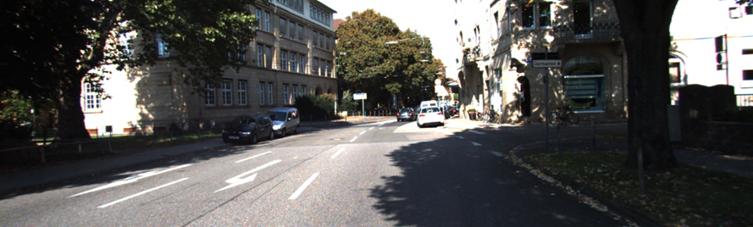
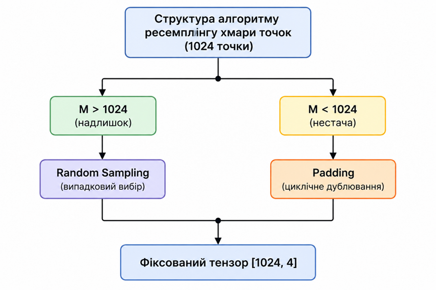
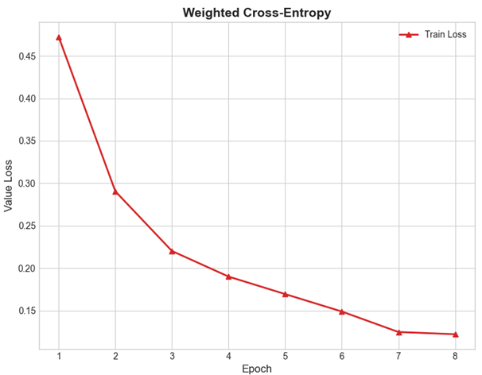
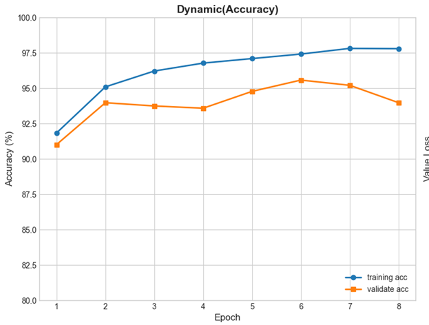
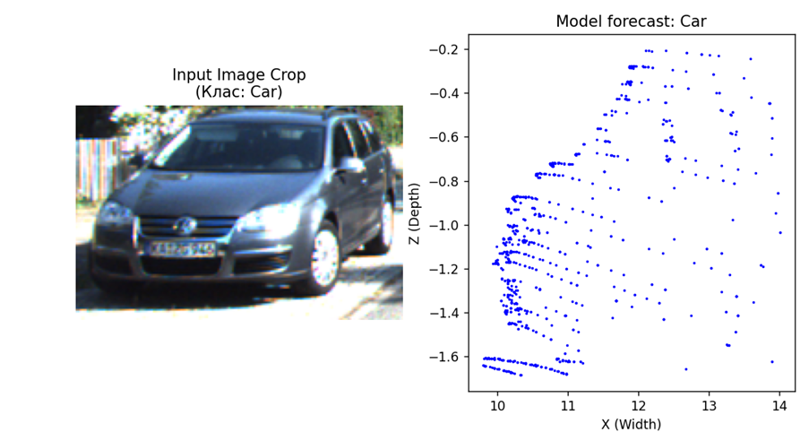

# Мультимодальний аналіз сцени на основі LiDAR та IR‑відео з використанням трансформерних архітектур

## Загальна інформація та автори
Науково-дослідна програмна розробка в галузі штучного інтелекту (Machine Learning / Computer Vision) для мультимодального злиття даних та класифікації тривимірних об'єктів.

| Параметр | Значення |
| :--- | :--- |
| **Автор** | Яремків Р.М. |
| **Група** | ФеІМ-12 |
| **Керівник** | ас. Марчук Ю.Б. |
| **Дата виконання** | 25.05.2026 |
| **Мова програмування** | Python 3.12 |
| **Основні бібліотеки**| PyTorch, NumPy, OpenCV, Matplotlib, PIL |

## Основний функціонал системи
* **Синхронізація сенсорів (Sensor Fusion):** Автоматичне калібрування та точна проєкція 3D-точок LiDAR на 2D-площину камери за допомогою матриць трансформації P2, R0, та V2C.
* **Геометрична сегментація:** Ефективне вирізання цільових об'єктів у хмарах точок за допомогою орієнтованих обмежувальних рамок (**OBB Cropping**).
* **Ресемплінг даних:** Приведення нерегулярних та хаотичних хмар точок до фіксованого розміру (1024 точки), що дозволяє проводити стабільну батч-обробку (Batch Processing).
* **Інтелектуальна класифікація:** Мультимодальне злиття ознак (**Intermediate Fusion**) з використанням архітектури Transformer Encoder з 8 паралельними головами уваги (Multi-Head Attention).
* **Балансування класів:** Мінімізація впливу незбалансованої вибірки через впровадження зваженої функції втрат (**Weighted Cross-Entropy**) у співвідношенні 1:5:10 для точного розпізнавання рідкісних об'єктів.
* **Real-time інференс:** Висока швидкість обробки даних — всього **25–30 мс** на один об'єкт при використанні графічного процесора початкового рівня (GPU NVIDIA GTX 1650).

--------------------------------------------------------------------------------
## Опис основних файлів
```bash
multimodal-transformer-kitti/
│
├── models.py              # Архітектура моделі Transformer Encoder
├── dataset.py             # Модуль завантаження та фільтрації датасету KITTI
├── lidar_cropper.py       # Алгоритми геометричного 3D-фільтрування точок
├── train.py               # Конвеєр (pipeline) навчання моделі
├── inference_script.py    # Демонстраційний скрипт / інференс на реальних даних
├── main.py                # Конвеєр попередньої обробки та підготовки даних
├── requirements.txt       # Список залежностей проєкту
└── README.md              # Документація проєкту
```
--------------------------------------------------------------------------------
# Як запустити проєкт 
1. Встановлення інструментів
* **Python 3.12+** — рекомендована версія для стабільної роботи архітектури.
* **CUDA Toolkit** — настійно рекомендовано для апаратного прискорення обчислений на GPU (NVIDIA).
```
pip install numpy opencv-python tqdm matplotlib torch torchvision pillow
```
або
```
pip install -r requirements.txt
```

2. Клонування та налаштування
```
git clone https://github.com/Astrisl/Multimodal-Transformer-KiTTi.git
cd multimodal-transformer-kitti
```
3. Підготовка даних (KITTI)
Розмістіть сирі дані KITTI у папку ```kitti_root/training``` та запустіть підготовку:
Після завершення обробки, у нас створиться папка ```full_lidar_crops/``` із ```.npy``` файлами з LiDAR
```
python lidar_crooper.py
```
4. Фінальна підготовка та синхронізація всього датасету
```
python dataset_crooper.py
```
5. Запуск навчання
```
python main.py
```
6. Перевірка моделі
```
python inference_script.py
```
--------------------------------------------------------------------------------
# Параметри моделі (Configuration)
Система використовує наступні гіперпараметри для оптимальної продуктивності на GPU з 4GB VRAM:
```json
{
  "embed_dim": 128,
  "nhead": 8,
  "num_layers": 3,
  "num_points": 1024,
  "class_weights": [1.0, 5.0, 10.0]
}
```

--------------------------------------------------------------------------------
# Інструкція для користувача
* **Модуль візуалізації:** Використовуйте ```KittiVisualizer``` для перевірки коректності накладання LiDAR точок на зображення перед навчанням.
* **Демонстрація (Demo):** Запустіть ```inference_script.py```, щоб побачити випадковий вибір сцени, де модель ліворуч показує фото об'єкта, а праворуч — його 3D-структуру та прогноз класу.
* **Аналіз логів:** Після навчання файл ```training_history.json``` містить дані для побудови графіків точності та втрат.

--------------------------------------------------------------------------------
# Приклади / скриншоти
Рис 1.1: Вихідне RGB зображення сцени KITTI.

Рис 2.1: Блок-схема алгоритму ресемплінгу точок.

Рис 4.1-4.2: Графіки збіжності Loss та Accuracy (пік — 95.57%).


Рис 4.3: Візуалізація класифікації: RGB-кроп автомобіля та його 3D-хмара точок.


--------------------------------------------------------------------------------
# Проблеми і рішення
Проблема
Рішення

FileNotFoundError
Додано блоки ```os.path.exists``` для перевірки цілісності 7481 кадру датасету.

IndexError (вихід за межі)
Використання ```np.clip``` для жорсткого обмеження координат кропів у межах H*W зображення.

Дисбаланс класів
Впроваджено Weighted Cross-Entropy (ваги 1:5:10 для Car, Pedestrian, Cyclist).

Переповнення VRAM
Оптимізація ```batch_size=16``` для роботи на картах рівня GTX 1650.

--------------------------------------------------------------------------------
# Використані джерела
* KITTI Dataset: Geiger A. et al., 2012.
* Transformer Architecture: Vaswani A. et al., 2017.
* PyTorch Documentation: Paszke A. et al., 2019.
* NumPy & OpenCV: Harris C.R. (2020), Bradski G. (2000)
